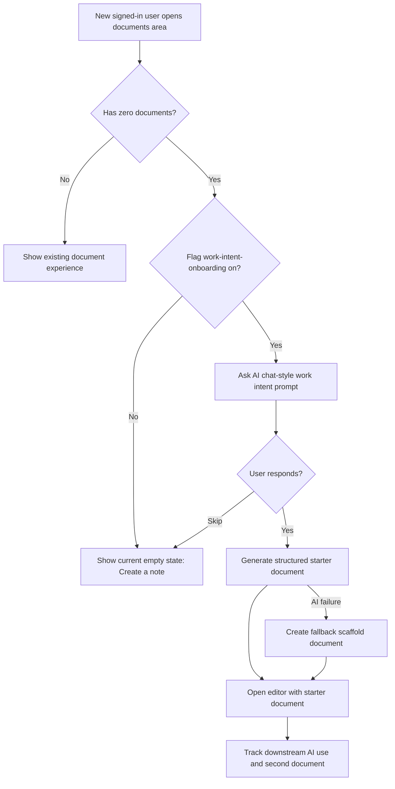

# Hand off: AI-First Onboarding PRD (New feature)

<aside>
💡 **TL;DR:** Test whether asking all new users what work they are doing before creating a blank document increases the 7-day second-document rate from the current 92-96% baseline while improving first-session AI activation.
</aside>

<aside>
📣 **Slack:** #product, #design, #engineering, #customer-success
</aside>

<aside>
🖼️ **Designs:** [add Figma link]
</aside>

<aside>
📊 **Dashboard:** [add Amplitude chart/dashboard link]
</aside>

# Context

- What is the problem to be solved? How critical is the problem?
  - New users currently enter Noted through document creation before the product asks what job they are trying to accomplish. Customer research says the fastest value moment is concrete AI help attached to a real note, while advanced or blank configuration creates drop-off. Jordan and Ethan both describe `/Ask AI` and Coworker as useful once they have a real problem, but Squad and broad AI capability feel fuzzy when the job is not framed first.
  - This is important because Noted's strategic loop depends on AI producing more document creation and repeat use, not just one impressive first artifact.
- What is the proposed solution?
  - **Near-term:** For all new users with zero documents, replace the blank-doc-first path with an AI chat-style onboarding prompt that asks what work they are doing, then creates a structured starter document from their answer.
  - **Long-term:** Use onboarding intent to personalize AI suggestions, starter templates, Coworker prompts, and later sharing/review nudges.
  - This PRD focuses on **Stage 2 planning review**: product bet, measurement, experiment shape, and open questions.
- What is the customer value?
  - The user starts with a real work outcome instead of a blank page. The product teaches "bring a messy problem, get a useful artifact" in the first session.
- What is the business value?
  - More users reach the AI-driven habit loop: first document, second document within 7 days, repeat AI use, and eventually sharing/team expansion.
- Describe or link any previous attempts to solve this problem, and what happened.
  - Current product offers explicit `/Ask AI` and Coworker after the user reaches the editor. AI value is strong, but the product does not teach when to use each entry point.
  - Squad Agents expose power too early for some users. Linear `NOT-17` tracks the adjacent onboarding cliff.

# Key assumptions:

- **All-new-user targeting is acceptable** — pending validation; owner: product. This experiment targets every new user with zero documents, not only students or solo creators.
- **Intent before document improves activation** — partially validated by Jordan, Ethan, and Lena interviews. They all describe stronger value when AI is grounded in a concrete job.
- **Structured starter docs are better than blank docs** — pending validation; owner: design/product. The current recommendation is to create a structured starter document because the primary metric requires document habit, and Coworker-only would delay the document loop.
- **Second document within 7 days is a valid primary metric** — partially validated by seeded Amplitude and Convex baselines. It is measurable today, but it may be near ceiling and should be paired with AI activation and return usage.

# Objectives

- Primary metric: increase users who create a second document within 7 days from the current baseline of 92-96% to [NEED: target from product] over [NEED: experiment runtime].
- Check metrics:
  - First-session AI activation: users who trigger `/Ask AI`, Coworker, or an onboarding-generated AI draft in first session.
  - Onboarding completion: eligible users who answer the intent prompt and land in a created document.
  - 7-day return: eligible users who return within 7 days after first document creation.
- Guardrails:
  - Document creation rate should not decrease materially versus control.
  - Time to first editable document should not increase enough to create friction. [NEED: acceptable threshold]
  - AI/error support tickets should not increase.
- Decision metric source: Amplitude for event funnels; Convex read-only query for document creation cross-check.

# Design scope:

- Who is the customer?
  - All new signed-in users with zero existing documents.
- What goals are we helping the customer accomplish?
  - Explain what they are trying to do in natural language.
  - Get a useful first document that reflects that job.
  - Learn that Noted's AI works best when attached to real writing/thinking.
- What does the customer experience look like?
  - Entrypoint: first visit to the authenticated documents area when the user has zero documents.
  - Main flow: AI chat-style prompt asks "What are you working on?" User answers in plain language. Noted creates a starter document with a title, outline, and first suggested next action.
  - End state: user lands in the editor with a structured starter document and can continue writing or invoke `/Ask AI`.
  - Skip state: user can skip and create a blank note.
  - Error state: if AI generation fails, create a blank document with a lightweight prompt scaffold and explain that the user can keep writing.
- What devices does this impact?
  - Desktop web first. Mobile web should preserve the current create-note fallback until design is validated.
- What is the user flow?

# Eng scope:

_Best filled after designs are completed_

- How does the flow change from customer perspective?
  - Eligible users see an AI chat-style first-run prompt before the blank document state.
  - The successful treatment creates a starter document instead of asking users to start from a blank note.
- How does the logic change?
  - Eligibility check: signed-in user, zero non-archived documents.
  - Document creation: creates a normal document in `documents` with generated title/content.
  - AI behavior: one-shot generation is likely enough for the starter document; streaming is optional and should only be added if design needs visible progress.
- What feature flag or rollout control is needed?
  - Flag key: `work-intent-onboarding`
  - Default behavior: off; current empty-state create-note flow remains fallback.
  - Gate client-side if the only change is rendered UI. Use server-side routing only if the implementation moves onboarding to a protected route that should not ship to control users.
- What new paths need to be logged?
  - `Onboarding Intent Prompt Shown` — `{ feature_flag_key, feature_flag_variant }`
  - `Onboarding Intent Submitted` — `{ intent_type, response_length_bucket, feature_flag_key, feature_flag_variant }`
  - `Onboarding Intent Skipped` — `{ feature_flag_key, feature_flag_variant }`
  - `Onboarding Starter Document Created` — `{ document_id, intent_type, ai_provider?, generation_result }`
  - Ensure all `Document Created` paths fire, including sidebar and onboarding-created documents.
  - Add `In-Editor AI Triggered`, `In-Editor AI Suggestion Accepted`, and `In-Editor AI Suggestion Rejected` before readout if AI activation is a check metric.
- For AI features, what behavior needs to be specified?
  - Model provider(s): BYOK provider selected in AI settings when available; [NEED: fallback behavior for users without AI settings].
  - Convex tables touched: `documents`; no schema change expected for Stage 2 unless storing onboarding intent long-term.
  - Streaming vs one-shot: default to one-shot generation for v1.
  - Input/output examples before Solution Review:
    - "I need to summarize lecture notes" -> study guide starter.
    - "I am drafting a launch brief" -> campaign brief outline.
    - "I am preparing for an interview" -> prep plan and question bank.
    - "I need to organize meeting notes" -> decisions/actions/risks template.
    - "I am brainstorming a product idea" -> problem, audience, assumptions, next tests.
  - Rejection criteria and edge cases:
    - Do not require AI setup before document creation unless the user explicitly chooses AI setup.
    - Do not block users who skip the prompt.
    - Do not store raw onboarding answers in analytics.
    - Do not generate sensitive content into analytics properties.
    - If generation fails, create a normal editable document with a static scaffold.

# Data scope:

- What data coverage or quality questions need to be answered?
  - Are `Document Created` events emitted from every creation path?
  - Can Amplitude distinguish control versus treatment via `feature_flag_key` and `feature_flag_variant`?
  - Does the user have a stable Amplitude ID before onboarding exposure?
  - Can Convex cross-check second-document creation by user and `_creationTime`?
- What dashboard or query will be used for readout?
  - Amplitude funnel: exposure -> intent submitted -> starter document created -> second document within 7 days.
  - Convex read-only query: users with first and second document creation within 7 days.
- How will we know the experience is better than the current alternative?
  - Compare treatment and control cohorts on the primary metric, first-session AI activation, onboarding completion, and 7-day return.
- What analysis must be completed before launch or readout?
  - Baseline current create paths and fix missing `Document Created` tracking before experiment start.
  - Confirm sample size and expected runtime from current new-user volume. [NEED: Amplitude population estimate]

# Ops scope:

- What changes for Customer Success, Ops, Sales, Legal, or Support teams are required?
  - CS should tag feedback as `onboarding-intent`, `ai-first-onboarding`, or `blank-doc-friction`.
  - Support FAQ should explain that users can skip the AI prompt and create a blank note.
- Does the process change?
  - Growth/product should review onboarding prompt transcripts manually only if they are stored safely. By default, do not store raw responses outside the created document.
- What proactive response or FAQ is needed?
  - "You can start with a blank note, or tell Noted what you are working on and let AI create a starter draft."

# Experiment design:

- What are you trying to learn?
  - Whether asking work intent before blank document creation increases document habit and first-session AI activation.
- Who is eligible?
  - All new signed-in users with zero existing documents.
- When should they be bucketed, and at what ratio?
  - Bucket once, at first eligible authenticated visit to the documents area.
  - Start 50/50 control/treatment.
- What is your primary metric?
  - Second document within 7 days. Baseline: 92-96% from seeded Amplitude/Convex data. Target: [NEED: product target].
- What are your check metrics?
  - First-session AI activation.
  - Onboarding prompt completion.
  - 7-day return.
  - Document publish/share/review progression when those events exist.
- What are your guardrails?
  - First document creation rate does not fall.
  - Skip rate does not indicate confusion. [NEED: acceptable threshold]
  - Save/create errors do not increase.
  - Support contacts tagged onboarding do not increase materially.
- How many samples do you need to detect the primary metric impact at 95% confidence?
  - [NEED: sample-size calculation from baseline, target lift, and weekly eligible new users]. Because the baseline is high, detecting lift on the primary metric may require a large sample; use AI activation and onboarding completion as faster leading indicators.
- Given the required samples, how long will this run for?
  - [NEED: current eligible new-user volume]. Minimum 2 full weeks after instrumentation validation so every cohort has 7-day observation.
- What is the decision criteria?
  - Roll out if treatment improves second-document-within-7-days or first-session AI activation without hurting first-document creation or support load.
  - Iterate if AI activation improves but second-document habit is flat.
  - Roll back if first-document creation, onboarding completion, or support confusion gets worse.

# Launch plan

- [NEED: date]: Instrumentation audit — product + engineering
- [NEED: date]: Prompt/design review — product + design
- [NEED: date]: Internal dogfood behind `work-intent-onboarding` — engineering
- [NEED: date]: 50/50 Amplitude Experiment launch — product
- [NEED: date + 14 days minimum]: Readout and rollout/iterate/rollback decision — product + analytics

---

_Template inspired by [aakashg/pm-claude-code-setup](https://github.com/aakashg/pm-claude-code-setup) (MIT) and adapted to Noted's hand-off PRD format._
